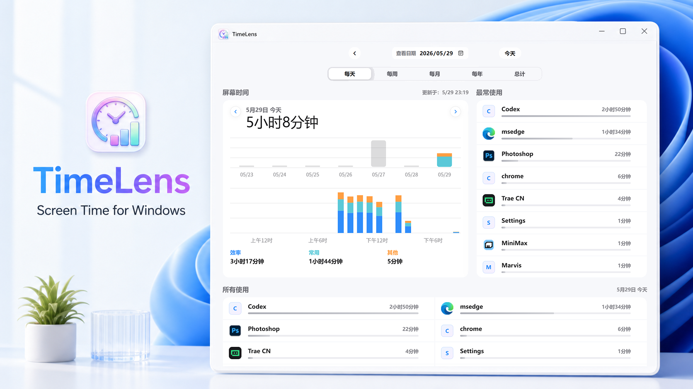

# TimeLens



TimeLens 是一个本地运行的 Windows 应用使用时间统计工具。它会在后台记录当前前台应用的使用时长，并通过一个简洁的本地网页仪表盘展示每天、每周、每月、每年和总计的使用情况。

数据只保存在本机，不需要账号，也不会上传到云端。

## 功能

- 自动记录前台应用使用时间
- 支持系统托盘运行
- 本地网页仪表盘查看统计数据
- 支持每小时、每天、每周、每月、每年和总计视图
- 支持选择日期和前后切换
- 显示屏幕时间、最常使用、所有使用记录
- 自动提取并缓存应用图标
- 支持 30 分钟无输入后的挂机判断
- 支持按规则区分效率、常用和其他应用类别
- 本地统计按键次数，并通过键盘热力图、小时趋势和常用键位查看使用情况

## KeyTrace 本机接口

TimeLens 在 `127.0.0.1:<config.json 中的 port>` 提供仅限本机访问的 KeyTrace 集成接口（默认端口为 `6001`）：

- `GET /api/integrations/keytrace/apps`：返回最近使用、最多使用和拥有可见窗口的正在运行应用。
- `GET /api/integrations/keytrace/sessions?process_name=...`：返回指定进程全部历史的合并前台区间，时间使用纳秒时间戳；当前尚未落盘的前台会话也会计入。

接口以不区分大小写的 `process_name` 标识应用，不向 KeyTrace 返回窗口标题。应用图标继续使用现有 `/api/icon/...` 接口。

## 运行环境

- Windows
- Python 3.10 或更高版本

## 安装

```bash
cd src
pip install -r requirements.txt
```

## 启动

```bash
python main.py
```

启动后，TimeLens 会：

- 开始后台记录应用使用时间
- 在系统托盘显示图标

## 端口配置

编辑程序根目录的 `config.json` 后重启 TimeLens：

```json
{
  "port": 6001
}
```

`port` 必须是 `1024–65535` 的整数。网页服务、系统托盘“打开 TimeLens”和 KeyTrace 集成接口都会使用该端口。打包程序首次运行时若配置文件不存在，会在 EXE 同级目录自动生成。

## 数据存储

使用记录保存在本地 SQLite 数据库中：

```text
data/usage.db
```

该文件包含个人使用记录，发布到 GitHub 时建议不要提交。推荐在 `.gitignore` 中忽略：

```gitignore
data/
__pycache__/
*.pyc
```

## 分类规则

应用分类规则位于：

```text
static/app-categories.js
```

你可以在这里调整哪些应用属于“效率”“常用”或“其他”。

## 项目结构

```text
src
|-- main.py                  # 程序入口，启动监控、Web 服务和系统托盘
|-- monitor.py               # 前台应用监控与挂机判断
|-- database.py              # SQLite 数据库读写与统计查询
|-- web_app.py               # Flask 本地 Web 服务和 API
|-- templates/
|   `-- dashboard.html       # 仪表盘页面
|-- static/
|   |-- style.css            # 页面样式
|   `-- app-categories.js    # 应用分类规则
|-- ico-64.png               # 托盘图标和网页图标
`-- requirements.txt         # Python 依赖
```

## 许可证

本项目源码使用 MIT License。

第三方运行时依赖清单见 [THIRD_PARTY_NOTICES.md](THIRD_PARTY_NOTICES.md)，完整许可证正文见 [THIRD_PARTY_LICENSES.txt](THIRD_PARTY_LICENSES.txt)。两份文件由 `src/tools/generate_third_party_licenses.ps1` 使用 `pip-licenses` 从当前 `src/venv` 构建环境生成，不应手工维护。

## 隐私说明

TimeLens 只在本机记录应用名称、进程名称、窗口标题、使用时间以及聚合后的键位次数，用于生成本地统计视图。按键跟踪不会保存输入内容或按键顺序，项目本身也不包含网络上传逻辑。
